# SpeakMCP IPC Flow Diagram

This document contains the visual representation of SpeakMCP's Inter-Process Communication architecture.

## Architecture Flow Diagram

```mermaid
graph TB
    %% External Components
    User[👤 User]
    RustBinary[🦀 Rust Binary<br/>speakmcp-rs]
    MCPServers[🔧 MCP Servers<br/>External Tools]
    LLMAPIs[🤖 LLM APIs<br/>OpenAI/Groq]
    
    %% Electron Main Process
    subgraph MainProcess[🖥️ Electron Main Process]
        MainIndex[main/index.ts<br/>App Entry Point]
        TIPCRouter[main/tipc.ts<br/>TIPC Router & API]
        KeyboardHandler[main/keyboard.ts<br/>Keyboard Events]
        WindowManager[main/window.ts<br/>Window Management]
        MCPService[main/mcp-service.ts<br/>MCP Client]
        LLMService[main/llm.ts<br/>Agent Engine]
        ConversationService[main/conversation-service.ts<br/>Persistence]
    end
    
    %% Preload Script
    Preload[⚡ Preload Script<br/>Context Bridge<br/>preload/index.ts]
    
    %% Renderer Process
    subgraph RendererProcess[🎨 Renderer Process]
        TIPCClient[renderer/lib/tipc-client.ts<br/>TIPC Client]
        RendererHandlers[Renderer Event Handlers<br/>Progress Updates]
        ReactApp[React Application<br/>UI Components]
        AgentProgress[Agent Progress UI<br/>Real-time Updates]
        PanelWindow[Panel Window<br/>Recording Interface]
        MainWindow[Main Window<br/>Settings & History]
    end
    
    %% User Interactions
    User -->|Keyboard Shortcuts<br/>Ctrl+Alt+\| RustBinary
    User -->|UI Interactions| ReactApp
    
    %% Rust Binary Communication
    RustBinary -->|JSON Events<br/>stdin/stdout| KeyboardHandler
    KeyboardHandler -->|Text Injection<br/>Commands| RustBinary
    
    %% Keyboard Event Flow
    KeyboardHandler -->|Show Panel<br/>Start Recording| WindowManager
    KeyboardHandler -->|Renderer Events| RendererHandlers
    
    %% TIPC Communication Layer
    TIPCClient -.->|Type-safe IPC<br/>ipcRenderer.invoke| Preload
    Preload -.->|Context Bridge<br/>Exposed APIs| TIPCRouter
    TIPCRouter -.->|Response| Preload
    Preload -.->|Response| TIPCClient
    
    %% Renderer Event Handlers (Main to Renderer)
    TIPCRouter -->|Event Emission<br/>getRendererHandlers| RendererHandlers
    RendererHandlers -->|UI Updates| ReactApp
    RendererHandlers -->|Progress Updates| AgentProgress
    RendererHandlers -->|Recording State| PanelWindow
    
    %% Core Application Flow
    TIPCRouter -->|Audio Processing<br/>Transcription| LLMAPIs
    TIPCRouter -->|Agent Mode<br/>Tool Execution| LLMService
    LLMService -->|Progress Updates<br/>emitAgentProgress| RendererHandlers
    LLMService -->|Tool Calls| MCPService
    MCPService -->|Execute Tools| MCPServers
    MCPServers -->|Tool Results| MCPService
    MCPService -->|Results| LLMService
    
    %% Window Management
    WindowManager -->|Window Control<br/>Show/Hide/Resize| PanelWindow
    WindowManager -->|Window Control| MainWindow
    TIPCRouter -->|Window Operations| WindowManager
    
    %% Conversation Management
    TIPCRouter -->|Save/Load<br/>Conversations| ConversationService
    ConversationService -->|Persistent Storage<br/>File System| ConversationService
    
    %% Main Process Initialization
    MainIndex -->|Register Router| TIPCRouter
    MainIndex -->|Initialize| KeyboardHandler
    MainIndex -->|Create Windows| WindowManager
    MainIndex -->|Setup Services| MCPService
    
    %% Styling
    classDef userClass fill:#e1f5fe,stroke:#01579b,stroke-width:2px
    classDef rustClass fill:#fff3e0,stroke:#e65100,stroke-width:2px
    classDef mainClass fill:#f3e5f5,stroke:#4a148c,stroke-width:2px
    classDef rendererClass fill:#e8f5e8,stroke:#1b5e20,stroke-width:2px
    classDef preloadClass fill:#fff8e1,stroke:#f57f17,stroke-width:2px
    classDef externalClass fill:#fce4ec,stroke:#880e4f,stroke-width:2px
    
    class User userClass
    class RustBinary rustClass
    class MainIndex,TIPCRouter,KeyboardHandler,WindowManager,MCPService,LLMService,ConversationService mainClass
    class TIPCClient,RendererHandlers,ReactApp,AgentProgress,PanelWindow,MainWindow rendererClass
    class Preload preloadClass
    class MCPServers,LLMAPIs externalClass
```



## Component Descriptions

### 🖥️ Electron Main Process
The main process handles system-level operations and serves as the central coordinator:

- **main/index.ts**: Application entry point, initializes all services and windows
- **main/tipc.ts**: TIPC router containing all API endpoints for renderer communication
- **main/keyboard.ts**: Manages keyboard events and communicates with Rust binary
- **main/window.ts**: Window management, positioning, and lifecycle
- **main/mcp-service.ts**: MCP client for external tool integration
- **main/llm.ts**: Agent engine with iterative tool calling
- **main/conversation-service.ts**: Persistent conversation storage

### 🎨 Renderer Process
The renderer process provides the user interface with real-time updates:

- **TIPC Client**: Type-safe communication with main process
- **Renderer Handlers**: Event listeners for main-to-renderer communication
- **React App**: Modern UI with component-based architecture
- **Agent Progress**: Real-time visualization of agent execution
- **Panel Window**: Recording interface and agent progress display
- **Main Window**: Settings, history, and configuration management

### ⚡ Preload Script
Security layer that safely exposes Electron APIs:

- **Context Bridge**: Secure API exposure to renderer process
- **IPC Wrapper**: Wraps ipcRenderer for TIPC communication
- **Security Isolation**: Prevents direct Node.js access from renderer

### 🦀 Rust Binary
Low-level system integration for cross-platform functionality:

- **Keyboard Monitoring**: Global hotkey detection (Ctrl+Alt+\)
- **Text Injection**: Cross-platform text insertion capabilities
- **JSON Communication**: stdin/stdout communication with main process

## Communication Flows

### 1. User Interaction Flow
```
User → Keyboard Shortcut → Rust Binary → Main Process → Renderer Update
User → UI Interaction → Renderer → TIPC → Main Process → Action
```

### 2. Agent Execution Flow
```
Audio Input → Transcription → Agent Engine → Tool Calls → MCP Servers
                ↓
Progress Updates → Renderer Handlers → UI Updates
```

### 3. Window Management Flow
```
Keyboard Event → Window Manager → Show/Hide/Resize → Panel Window
TIPC Request → Window Manager → Window Operations → UI Response
```

### 4. Real-time Updates Flow
```
Main Process Event → getRendererHandlers → Renderer Handlers → React State → UI Update
```

## Key Features

### Type Safety
- **Full TypeScript**: All IPC communication is fully typed
- **Compile-time Validation**: Interface mismatches caught at build time
- **Shared Types**: Common types between main and renderer processes

### Real-time Communication
- **Event-driven**: Immediate UI updates for state changes
- **Progress Tracking**: Live agent execution visualization
- **Bidirectional**: Both request-response and event emission patterns

### Security
- **Context Isolation**: Renderer cannot directly access Node.js APIs
- **Sandboxed MCP**: External tools run in separate processes
- **Secure Bridge**: Preload script provides controlled API access

### Performance
- **Efficient Updates**: Debounced progress updates prevent UI flooding
- **Background Processing**: Heavy operations in main process
- **Memory Management**: Proper cleanup and resource management

This architecture enables SpeakMCP to provide a responsive, secure, and feature-rich voice-controlled AI assistant with seamless integration of external tools and services.
